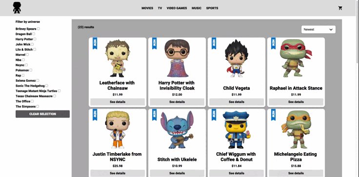

# Ecommerce for Funko Pop collectible toys
## Links
[Repository](https://github.com/vlaurencena/react-app-victor-laurencena) | [Contact](mailto:victorlaurencena@gmail.com) | [Live version](https://funko-town.herokuapp.com/)
## Description
It is an ecommerce dedicated to selling Funko Pop dolls. The products are classified according to category and "universe" to which the figure belongs to. 
## Built with
* HTML.
* CSS.
* JavaScript.
* React.
* React Router DOM: I chose to work with this components library to work with dynamic routing.
* Firebase: I decided to work with this service because this project did not have too many requirements and Firebase provides a quick and easy way to create a database.
## Project preview

## Installation and Setup Instructions
Clone down this repository. You will need `node` and `npm` installed globally on your machine.  

Installation:

`npm install`  

To Run Test Suite:  

`npm test`  

To Start Server:

`npm start`  

To Visit App:

`localhost:3000/`  
## Extra Info
  - This was a 7 week long project built during the React Js course dictated by Coderhouse. Project goals included using the technologies learned during the course and familiarizing myself with React's features.
  - It is not meant to be responsive or aesthetic, as it's main focus was to implement React.
